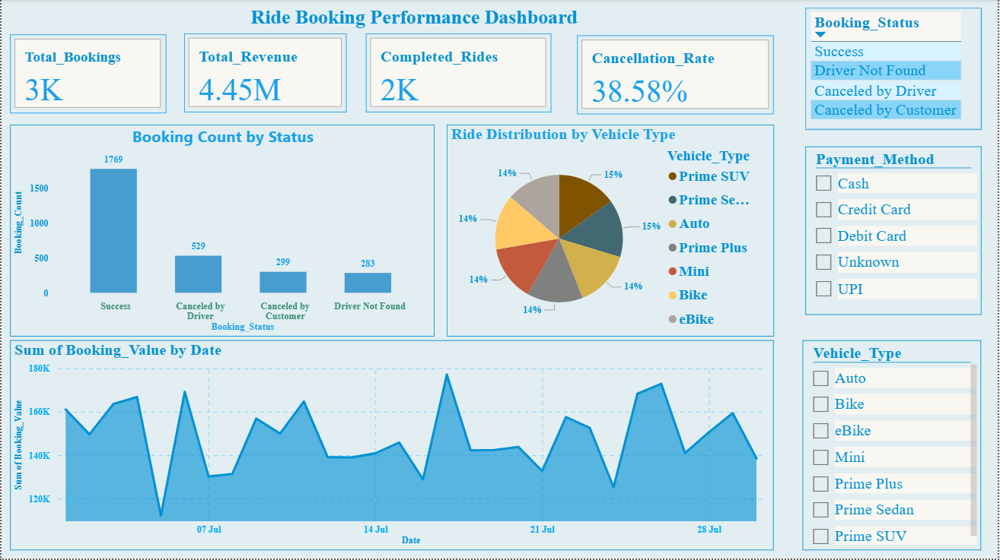

# 🚖 Ride Booking Performance Dashboard

This Power BI dashboard analyzes key metrics of a ride-booking platform, such as total bookings, revenue, vehicle type usage, and cancellation rates.

## 🔍 Key Insights
- 📦 **Total Bookings**: 3K
- 💰 **Revenue**: ₹4.45M
- 🚗 **Vehicle Types**: Auto, Bike, eBike, Mini, SUV, etc.
- 📉 **Cancellation Rate**: 38.58%
- 📊 Visuals: Bar, Pie, Line Charts

## ⚙️ Tech Stack
- Power BI
- DAX (Calculated Measures)
- Excel (for preprocessing)

## 📸 Dashboard Preview

---

📌 Developed by [Vaibhav Karale](https://github.com/VAIBHAVKARALE1011)
